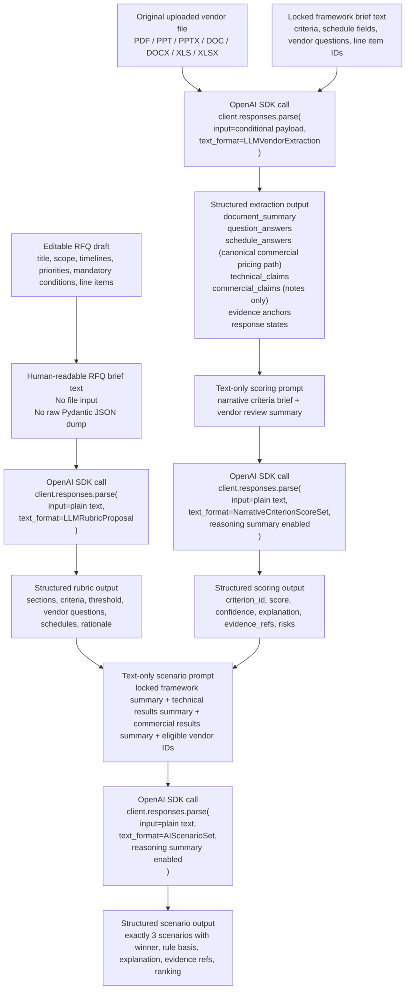

# Implementation Pipeline

## Purpose
This document captures the currently implemented pipeline from vendor document submission through extraction, normalization, evaluation, advisory scenario generation, and official award output.

It reflects the code as it exists today, not just the intended design.

## End-To-End Flow

```mermaid
flowchart TD
    P0["Phase 1 prerequisite<br/>GenAI converts RFQ brief text into a structured rubric<br/>OpenAI SDK: client.responses.parse()<br/>Structured output schema: LLMRubricProposal"]
    P["LockedFrameworkArtifact exists"]
    P0 -. produces .-> P

    U["Vendor document upload<br/>PUT /sessions/:session_id/vendors/:vendor_id/document<br/>main.upload_vendor_document()<br/>SessionStore.save_vendor_document()"]
    P --> U

    X["Buyer runs extraction<br/>POST /sessions/:session_id/vendors/:vendor_id/extract<br/>main.extract_vendor_document()"]
    U --> X

    G1["GenAI extraction<br/>OpenAI SDK: client.responses.parse()<br/>Input = conditional document payload + locked framework brief text<br/>Structured output schema: LLMVendorExtraction"]
    X --> G1

    R["Structured extraction object<br/>question answers + schedule answers + technical claims + commercial claims + evidence anchors + response states"]
    G1 --> R

    N["Deterministic review + normalization<br/>No model call here<br/>Python converts extracted values into normalized fields and normalized pricing"]
    R --> N

    S["VendorReview stored<br/>SessionStore.save_vendor_review()"]
    N --> S

    C["Automatic normalization basis<br/>RFQ base currency + stored ECB FX snapshot<br/>Weight/volume UOM math only<br/>No buyer-entered comparison settings"]
    S --> C

    E["Buyer runs evaluation<br/>POST /sessions/:session_id/evaluation/run<br/>main.run_session_evaluation()"]
    C --> E

    T["Evaluation orchestration<br/>run_evaluation()"]
    E --> T

    D["Deterministic technical scoring<br/>_evaluate_criterion_deterministically()<br/>MAC / pass-fail / numeric / discrete bands"]
    G2["GenAI narrative technical scoring<br/>OpenAI SDK: client.responses.parse()<br/>Input = text-only criteria brief + text-only vendor review summary<br/>Structured output schema: NarrativeCriterionScoreSet<br/>Reasoning summary enabled"]
    T --> D
    T --> G2

    TG["Technical gate<br/>MAC pass + critical cutoff pass + aggregate threshold"]
    D --> TG
    G2 --> TG

    M["Commercial evaluation<br/>_build_commercial_results()<br/>FX/UOM comparability + normalized totals<br/>Commercial score = 100 * lowest_total / vendor_total"]
    TG --> M

    O["Official award<br/>_build_official_recommendation()<br/>QCBS = 0.70 * technical + 0.30 * commercial"]
    M --> O

    LQ["Deterministic advisory views<br/>_build_standard_scenarios()<br/>LCS + QBS"]
    O --> LQ

    G3{"Eligible vendors exist?"}
    O --> G3

    AIG["GenAI advisory scenarios<br/>OpenAI SDK: client.responses.parse()<br/>Input = text-only locked framework summary + technical result summary + commercial result summary + eligible IDs<br/>Structured output schema: AIScenarioSet<br/>Reasoning summary enabled"]
    G3 -->|Yes| AIG

    SAVE["EvaluationReport stored<br/>SessionStore.save_evaluation_report()<br/>GET /results for UI"]
    LQ --> SAVE
    AIG --> SAVE
    G3 -->|No| SAVE

    classDef genai fill:#fff1cc,stroke:#b58900,stroke-width:1.5px;
    class P0,G1,G2,AIG genai;
```


## GenAI-Only View
This section focuses only on the steps that currently make OpenAI SDK calls.



## GenAI Entry Points

### Shared SDK Client
- SDK class: `openai.OpenAI`
- Instantiated inside `OpenAIResponsesClient.__init__()`
- Azure usage is via `base_url`, not via `AzureOpenAI`
- Shared SDK method: `self._client.responses.parse(...)`
- The current implementation does not use:
  - `client.chat.completions.create(...)`
  - `client.responses.create(...)`
  - `client.files.create(...)`
  - `AzureOpenAI`

## Actual OpenAI SDK Usage

### Common Pattern
All current LLM steps use the OpenAI Python SDK `Responses` interface through:

```python
from openai import OpenAI

client = OpenAI(
    base_url=AZURE_OPENAI_ENDPOINT,
    api_key=AZURE_OPENAI_API_KEY,
)

response = client.responses.parse(
    model=MODEL_NAME,
    instructions=...,
    input=...,
    text_format=...,
)
```

Structured output is enabled by `text_format=<Pydantic model>`.
The parsed result is then read from `response.output_parsed`.

### Phase 1 Rubric Generation
- SDK call: `client.responses.parse(...)`
- Input type: plain text only
- File input: no
- Structured outputs: yes
- Reasoning summary: no
- Current payload shape:

```python
response = client.responses.parse(
    model=self._model,
    instructions=instructions,
    input=input_text,
    text_format=LLMRubricProposal,
)
```

- What `input` contains:
  - A human-readable RFQ brief string
  - Not a raw Pydantic JSON dump
  - No uploaded files
- Structured rubric shape:
  - Non-commercial criteria own their `vendor_question` directly
  - The top-level `questions[]` list is derived after parsing for compatibility with extraction, export, and vendor-pack views

### Phase 2 Vendor Extraction
- SDK call: `client.responses.parse(...)`
- Input type: conditional by document format
- File input: yes for PDF and spreadsheets, no for Word and PowerPoint
- Structured outputs: yes
- Reasoning summary: no
- Current payload shapes:

```python
response = client.responses.parse(
    model=self._model,
    instructions=instructions,
    input=[
        {
            "role": "user",
            "content": [
                {
                    "type": "input_file",
                    "filename": document.file_name,
                    "file_data": file_data,
                },
                {
                    "type": "input_text",
                    "text": "...locked framework brief...",
                },
            ],
        }
    ],
    text_format=LLMVendorExtraction,
)
```

- For PDF, XLS, and XLSX:
- `input_file` contains:
  - The original uploaded vendor document bytes
  - Converted locally into a base64 data URL by `build_file_data_url()`
  - Format: `data:{mime_type};base64,{...}`

- For DOCX:

```python
response = client.responses.parse(
    model=self._model,
    instructions=instructions,
    input=(
        "...locked framework brief...\n\n"
        "Converted vendor document HTML\n"
        "<p>...</p>"
    ),
    text_format=LLMVendorExtraction,
)
```

- For DOC:
  - The file is first converted locally to `.docx`
  - Then extracted through the same HTML fallback path as DOCX

- For PPTX:

```python
response = client.responses.parse(
    model=self._model,
    instructions=instructions,
    input=(
        "...locked framework brief...\n\n"
        "Converted presentation content\n"
        "Slide 1\nText lines\n- ...\nTable 1\n..."
    ),
    text_format=LLMVendorExtraction,
)
```

- For PPT:
  - The file is first converted locally to `.pptx`
  - Then extracted through the same slide-text-and-table fallback path as PPTX

- What this means:
  - The extraction step is still one LLM call per vendor document, not one call per question
  - PDFs and spreadsheets are sent as native file input
  - Word and PowerPoint files are converted locally into structured text before the LLM call
  - The model is asked to return all requested questionnaire evidence in one schema-bound response
  - Commercial and measurable fields should separate `numeric_value`, `currency`, `quantity_value`, and `uom` instead of collapsing them into one prose string
  - Line-item commercial pricing is canonical only in `schedule_answers`; `commercial_claims` are for supporting notes that do not fit a requested schedule field

### What the extraction model is expected to produce
- One structured extraction object for the whole vendor submission
- For each buyer question:
  - answer value or missing-state
- For each requested schedule field:
  - answer value or missing-state
- For technical and commercial claims:
  - extracted value
  - `numeric_value` for the explicit amount or numeric answer only
  - `quantity_value` for the explicit quantity only
  - `currency` as a separate structured field
  - `uom` as a separate structured field
  - normalized hint
  - evidence snippet
  - location marker such as page, slide, or sheet/cell
- Response state classification:
  - `answered`
  - `missing_vendor_response`
  - `missing_extractable_evidence`
  - `conflicting_evidence`
  - `not_applicable`

### Automatic Normalization Basis
- Currency conversion is derived automatically from the RFQ base currency and a checked-in ECB reference-rate snapshot.
- The buyer does not enter FX rates in the main demo flow.
- `Lot` and count-style units do not convert mathematically.
- Only weight and volume units convert mathematically.

### Phase 2 Narrative Technical Scoring
- SDK call: `client.responses.parse(...)`
- Input type: plain text only
- File input: no
- Structured outputs: yes
- Reasoning summary: yes
- Current payload shape:

```python
response = client.responses.parse(
    model=self._model,
    instructions=instructions,
    input=(
        f"Vendor: {vendor.name}\n\n"
        f"RFQ: {artifact.rfq_snapshot.general_info.subject}\n\n"
        "Narrative criteria to score\n"
        f"{criteria_brief}\n\n"
        "Vendor review summary\n"
        f"{review_brief}"
    ),
    text_format=NarrativeCriterionScoreSet,
    reasoning={"summary": "auto"},
)
```

- What `input` contains:
  - Locked technical criteria summary
  - Textual vendor review summary derived from extraction
  - No raw file and no direct PDF re-read
  - Only narrative technical criteria are sent to the model
  - Objective criteria are handled outside the model

### What the narrative scoring model is expected to produce
- One structured score entry per narrative technical criterion
- For each criterion:
  - `criterion_id`
  - `score`
  - `confidence`
  - `explanation`
  - `evidence_refs`
  - `risks`

### Phase 2 AI Scenario Generation
- SDK call: `client.responses.parse(...)`
- Input type: plain text only
- File input: no
- Structured outputs: yes
- Reasoning summary: yes
- Current payload shape:

```python
response = client.responses.parse(
    model=self._model,
    instructions=instructions,
    input=(
        "Locked RFQ framework\n"
        f"{self._build_locked_framework_brief(artifact)}\n\n"
        "Technical evaluation summary\n"
        f"{self._build_technical_results_brief(technical_results)}\n\n"
        "Commercial evaluation summary\n"
        f"{self._build_commercial_results_brief(commercial_results)}\n\n"
        f"Eligible winner vendor ids: {', '.join(eligible_vendor_ids)}"
    ),
    text_format=AIScenarioSet,
    reasoning={"summary": "auto"},
)
```

- What `input` contains:
  - Locked RFQ framework summary
  - Technical result summary
  - Commercial result summary
  - Eligible vendor IDs
  - No raw vendor files
  - The model is constrained to choose winners only from the eligible vendor set
  - The model is not intended to invent new post-bid criteria

### What the scenario model is expected to produce
- Exactly 3 scenarios
- For each scenario:
  - `scenario_name`
  - `winner_vendor_id`
  - `weighting_or_rule_basis`
  - `explanation`
  - `evidence_refs`
  - `ranking`

## What Is Not a GenAI Step
- Field normalization is not a model call
- Pricing normalization is not a model call
- Currency conversion is not a model call
- UOM conversion is not a model call
- Comparability checks are not a model call
- Technical gate enforcement is not a model call
- Commercial score calculation is not a model call
- Official QCBS calculation is not a model call
- `LCS` and `QBS` are not model calls

## Deterministic Steps
- Vendor document validation and storage
- Raw extraction post-processing into `RawExtraction`
- Review generation and normalization into `VendorReview`
- Currency and UOM comparability checks
- Deterministic criterion scoring for MAC, pass/fail, numeric-banded, and discrete-banded rules
- Technical gate enforcement
- Commercial score computation
- Official QCBS 70/30 winner selection
- Deterministic advisory `LCS` and `QBS`

## Main Orchestration Points
- `main.upload_vendor_document()`
- `main.extract_vendor_document()`
- `build_vendor_review()`
- `main.save_comparison_settings()`
- `main.run_session_evaluation()`
- `run_evaluation()`
- `_build_technical_results()`
- `_build_commercial_results()`
- `_build_official_recommendation()`
- `_build_standard_scenarios()`

## Notes
- The technical gate excludes commercial criteria.
- Commercial evaluation runs only for vendors that pass the technical gate.
- AI-generated scenarios are advisory only and do not override the official QCBS result.
- The current implementation uses a single full-document extraction call per vendor, not one LLM call per question.
- Narrative technical scoring and AI scenario generation do not read vendor files directly; they operate on textual summaries derived from prior extraction and normalization.
- Extraction is the only current Phase 2 step that sends the original vendor document itself to the model.
