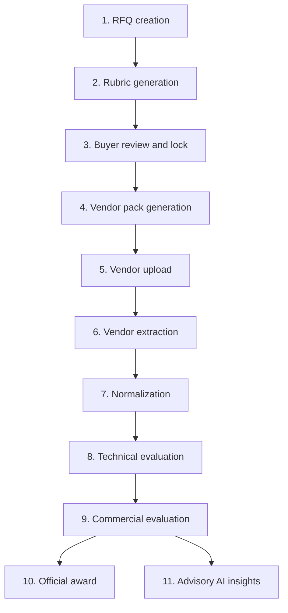

# End-to-End Flow

This page describes the TenderLens workflow step by step. For each stage, it states:

- what the step does
- what the user does
- what the system does
- whether AI is used
- what output is produced for the next stage

## Flow summary

## 1. RFQ creation

- **Purpose:** Capture the buyer’s RFQ context before any evaluation model is generated.
- **User action:** Enter or load RFQ details such as title, scope, timelines, priorities, mandatory conditions, currency, and line items.
- **System action:** Store the draft RFQ as the starting point for framework generation.
- **AI role:** **No AI in this step.**
- **Output:** One editable RFQ draft.

## 2. Rubric generation

- **Purpose:** Convert buyer intent into a structured evaluation framework.
- **User action:** Trigger rubric generation from the RFQ draft.
- **System action:** Assemble a human-readable RFQ brief and send it to the model.
- **AI role:** **Yes.** AI proposes:
  - rubric sections
  - criterion types
  - threshold and cutoff structure
  - vendor-facing questions
  - structured schedules
  - rationale for the proposed framework
- **Output:** One connected rubric proposal for buyer review.

## 3. Buyer review and lock

- **Purpose:** Let the buyer ratify the framework before any vendor is evaluated.
- **User action:** Review the proposal, edit it if needed, and lock it.
- **System action:** Validate the framework, freeze it as a locked artifact, and derive the vendor pack from it.
- **AI role:** **No AI in this step.**
- **Output:** Locked framework artifact plus derived vendor pack.

## 4. Vendor pack generation

- **Purpose:** Produce the outbound vendor-facing RFQ package from the locked framework.
- **User action:** Preview and export the vendor-facing RFQ pack.
- **System action:** Compile vendor-visible RFQ details, questions, schedules, and response instructions from the locked artifact.
- **AI role:** **No AI in this step.**
- **Output:** Vendor-facing RFQ pack in browser preview, JSON, and document export.

## 5. Vendor upload

- **Purpose:** Register bidders and collect one source document per vendor.
- **User action:** Add vendors and upload exactly one document per vendor.
- **System action:** Store the original file, metadata, and status for each vendor.
- **AI role:** **No AI in this step.**
- **Output:** Vendor registry with uploaded source documents ready for extraction.

## 6. Vendor extraction

- **Purpose:** Pull structured answers and evidence from messy vendor documents.
- **User action:** Trigger extraction.
- **System action:** Send one extraction request per vendor document against the locked framework.
- **AI role:** **Yes.** AI reads the original vendor file and returns:
  - question answers
  - schedule answers
  - technical claims
  - commercial notes
  - evidence anchors
  - response states such as missing or conflicting evidence
- **Output:** Structured vendor extraction object per vendor.

## 7. Normalization

- **Purpose:** Convert extracted values into a comparable evaluation basis.
- **User action:** Review the normalized output in read-only form.
- **System action:** Apply deterministic currency and supported unit normalization, preserve blockers, and build normalized fields and pricing lines.
- **AI role:** **No AI in this step.**
- **Output:** Vendor review object with raw extraction, normalized fields, normalized pricing, and evidence references.

## 8. Technical evaluation

- **Purpose:** Decide which vendors are technically qualified and how strong they are technically.
- **User action:** Run evaluation and inspect the technical output.
- **System action:** Score objective criteria deterministically and enforce MAC plus threshold logic.
- **AI role:** **Partially.**
  - **AI is used** for narrative technical criteria that need qualitative judgment.
  - **AI is not used** for deterministic pass/fail or numeric/discrete scoring rules once those rules are locked.
- **Output:** Vendor-level technical result with criterion scores, pass/fail status, summary, and evidence references.

## 9. Commercial evaluation

- **Purpose:** Compare only the technically qualified vendors on a normalized commercial basis.
- **User action:** Review normalized pricing and commercial comparison output.
- **System action:** Check comparability, compute comparable totals, and calculate commercial scores.
- **AI role:** **No AI in this step.**
- **Output:** Commercial result set for the technically qualified pool.

## 10. Official award

- **Purpose:** Produce the formal governed recommendation.
- **User action:** Inspect the official result.
- **System action:** Apply the fixed official formula:
  - technical qualification first
  - then commercial scoring
  - then QCBS 70/30
- **AI role:** **No AI in this step.**
- **Output:** One official award recommendation with score breakdown and explainability.

## 11. Advisory AI insights

- **Purpose:** Show alternative value lenses without overriding the official result.
- **User action:** Inspect QBS, LCS, and AI scenarios.
- **System action:** Build deterministic advisory views such as LCS and QBS, then ask the model for contextual AI-generated scenarios.
- **AI role:** **Yes, but only for the advisory scenario layer.**
- **Output:** Advisory result set with explanations, scenario logic, and winner suggestions that remain separate from the official result.

## Why this flow is strong

The most important property of this flow is that every step feeds the next one through a stable object model:

- the RFQ draft informs the rubric
- the locked rubric informs the vendor pack
- the locked rubric also informs the extractor
- the extracted outputs inform normalization
- normalization and technical results inform the official and advisory outputs

That is why TenderLens is not just “an AI demo.” It is a connected evaluation system.
