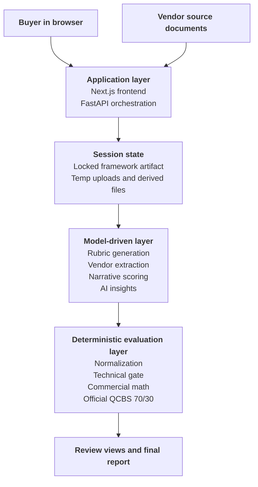

# Overview

TenderLens is an AI-assisted procurement prototype that helps a buyer move from an RFQ to a locked evaluation framework, then from messy vendor submissions to an explainable award recommendation.

This documentation is intentionally written as a **submission narrative**, not as a frontend user guide. The goal is to show the problem being solved, the system design choices, the evaluation philosophy, and the tradeoffs behind the implementation.

## What problem this prototype solves

In real procurement workflows, vendors rarely respond in one clean standard template. Pricing may be in a table inside a PDF, assumptions may sit in a Word narrative, and critical technical claims may be buried in slides or annexures. The buyer is then forced to compare:

- incomplete answers
- inconsistent pricing structures
- different document formats
- unclear scope coverage
- claims that are difficult to verify quickly

The hard problem is not just “extract some text from documents.” The harder problem is deciding **how value should be defined before the bids are judged**, and then keeping the extraction and scoring aligned to that definition.

## System thesis

TenderLens is built around one central idea:

> Generate a strong RFQ-specific evaluation framework first, lock it, and then make every downstream step obey that same framework.

That design matters because it avoids a weak multi-step AI pattern where:

- one model invents vendor questions
- another model guesses what to extract
- another model improvises how to score
- the final recommendation is hard to audit

Instead, TenderLens uses one connected framework generation phase to create:

- criterion classifications
- technical and commercial structure
- thresholds and cutoffs
- exact vendor-facing questions
- structured schedules
- evidence expectations

Once the buyer reviews and locks that framework, the extractor, normalizer, scorer, and recommender all stay grounded to the same structure.

## High-level system design

This is the **system-design view**, not the click-by-click buyer flow. The evaluator journey is documented separately on the [End-to-End Flow](./end-to-end-flow) page.

At a high level, the runtime is organized into four layers:

The locked framework inside session state governs both the model-driven stage and the deterministic evaluation stage, even though that control relationship is not drawn as a separate arrow here in order to keep the diagram readable.

1. **Application layer**: the browser UI and FastAPI backend drive the session, review flow, and result presentation.
2. **Session state**: the system keeps the locked framework, vendor artifacts, and derived reports tied to one session context.
3. **Model-driven stages**: AI is used for framework generation, vendor extraction, narrative technical scoring, and advisory scenarios.
4. **Deterministic stages**: normalization, qualification, commercial math, and the official QCBS result remain governed by fixed logic.

## Why the workflow is framework-first

The strongest design decision in TenderLens is that evaluation logic is created before vendor evaluation begins.

That creates three benefits:

1. **Lower AI subjectivity**  
   The model is not asked to make up new criteria after seeing the bids.

2. **Cleaner explainability**  
   A buyer can trace a score or disqualification back to a locked criterion, question, schedule field, and evidence anchor.

3. **Better system cohesion**  
   The questionnaire generator, extractor, scorer, and recommender are all aligned because they are reading from the same framework object.

## Where AI is used

:::tip Where AI is used
- Generating the initial RFQ-specific rubric, question set, schedules, and rationale
- Extracting structured vendor responses and evidence from messy submission files
- Scoring narrative technical criteria that are qualitative by nature
- Generating advisory AI scenarios and buyer-facing reasoning summaries
:::

## Where AI is not used

:::info Where AI is not used
- Locking and freezing the buyer-approved framework
- Currency normalization and weight/volume unit conversion
- Technical gate enforcement once scores and pass/fail outputs exist
- Commercial comparability checks and line-item total computation
- Official QCBS 70/30 score calculation
- Separation of official result from advisory insight
:::

## Key features

- AI-generated rubric proposal with buyer review before lock
- Strong criterion taxonomy across MAC, scored technical, cutoff-backed technical, and commercial criteria
- One locked framework artifact that drives downstream evaluation
- One extraction call per vendor document against the whole framework
- Canonical commercial pricing extraction through structured schedules
- Readable evidence-backed review and result views
- Official QCBS 70/30 result plus advisory `LCS`, `QBS`, and AI scenarios

## Assumptions in the current prototype

- No authentication, user accounts, or multi-user collaboration
- No durable database; session state is held in memory for the demo flow
- One browser session is the main working context
- One vendor document per vendor
- Narrative-only documentation site with no artifact downloads
- Submission-first documentation, not an operator handbook
