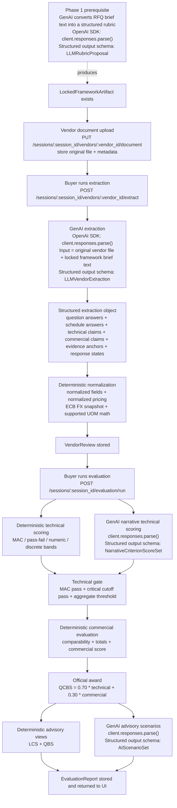
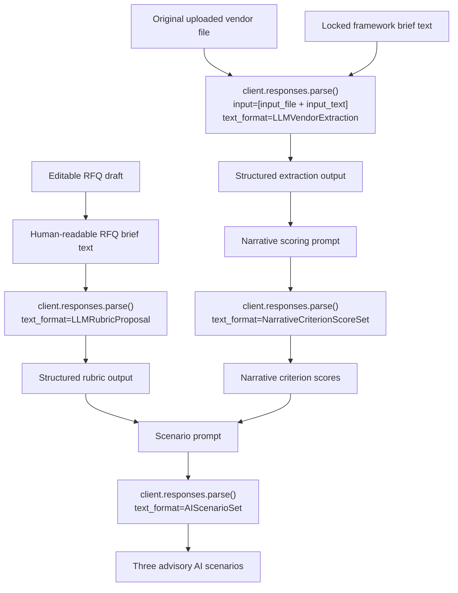

# Implementation Pipeline

This appendix captures the implemented pipeline from vendor document upload through extraction, normalization, evaluation, advisory scenarios, and final output.

## End-to-end technical flow



## GenAI-only view



## Exact OpenAI SDK shape

TenderLens uses the Python `OpenAI` SDK pointed at the Azure-hosted base URL. It does **not** use `AzureOpenAI`, `chat.completions.create`, or `files.create`.

### Shared client shape

```python
from openai import OpenAI

client = OpenAI(
    base_url=AZURE_OPENAI_ENDPOINT,
    api_key=AZURE_OPENAI_API_KEY,
)
```

### Rubric generation

```python
response = client.responses.parse(
    model=self._model,
    instructions=instructions,
    input=input_text,
    text_format=LLMRubricProposal,
)
```

### Vendor extraction

```python
response = client.responses.parse(
    model=self._model,
    instructions=instructions,
    input=[
        {
            "role": "user",
            "content": [
                {
                    "type": "input_file",
                    "filename": document.file_name,
                    "file_data": file_data,
                },
                {
                    "type": "input_text",
                    "text": locked_framework_brief,
                },
            ],
        }
    ],
    text_format=LLMVendorExtraction,
)
```

### Narrative technical scoring

```python
response = client.responses.parse(
    model=self._model,
    instructions=instructions,
    input=scoring_prompt,
    text_format=NarrativeCriterionScoreSet,
)
```

### Advisory AI scenarios

```python
response = client.responses.parse(
    model=self._model,
    instructions=instructions,
    input=scenario_prompt,
    text_format=AIScenarioSet,
)
```

## What is deterministic versus model-driven

### Model-driven stages

- rubric proposal generation
- vendor extraction from messy documents
- narrative technical scoring
- advisory AI scenario generation

### Deterministic stages

- framework lock
- normalized pricing construction
- currency and supported UOM conversion
- MAC and threshold enforcement
- commercial score computation
- official QCBS 70/30 calculation

## Lightweight traceability note

TenderLens does not treat explainability as a post-processing cosmetic step. The system keeps:

- raw question answers
- structured schedule answers
- normalized fields
- normalized pricing lines
- evidence anchors
- buyer-readable snippets

That is why the result pages can show not only a score, but also the reasoning path behind the score.
